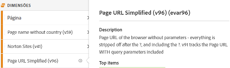
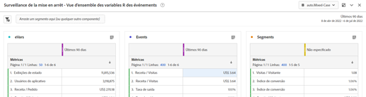

# Baixar o playbook de implementação do Adobe Analytics

Antes de começar, [baixar o playbook](assets/aa-implementation-playbook.xlsx).

## Guia Requisitos de empresa

**O QUE:** Um Documento de requisitos comerciais (geralmente chamado de BRD) é uma documentação muito importante que os principais interessados, usuários empresariais e usuários de tecnologia desejarão colaborar. É um local para documentar todos os KPIs, requisitos de relatórios e qualquer ponto de dados desejado que você deseja ver quando a implementação do Adobe Analytics (AA) for concluída.

**POR QUE:** Isso serve como um ponto de partida para a documentação a seguir (SDR, especificação técnica, etc.) e é uma fonte comum de verdade para um estado final acordado de AA. Este documento organiza pensamentos em todas as equipes na organização para formar uma direção orientadora para avançar com a criação ou o aprimoramento da implementação.

**COMO:** A documentação dos requisitos de negócios é comumente feita pelos usuários finais de negócios do AA, mas é importante obter feedback dos usuários de tecnologia, pois pode haver desafios técnicos a serem observados e alguns pontos de dados podem exigir mais esforço do que outros, o que faz parte da priorização.

Pergunte a si mesmo, &quot;quais são as coisas que queremos rastrear em nosso site&quot;, &quot;quais pontos de dados serão importantes para mim no uso de relatórios&quot; e, mais importante, &quot;como esses pontos de dados informarão as decisões&quot;. É importante garantir que cada um dos requisitos de negócios esteja relacionado a um ponto de dados que possa ser usado para informar as decisões de negócios. Por exemplo, pode ser tentador rastrear todos os cliques no site, mas no fim do dia, que insights você está obtendo com esses relatórios?

Comece preenchendo a coluna C na captura de tela abaixo (Requisito comercial). Isso deve ser algo como &quot;Quantas pesquisas internas estão concluídas em nosso site&quot; ou &quot;Qual ponto de campanha interno é mais eficaz em termos de impressões&quot;. Após preencher esse nível de detalhes, você pode voltar e preencher a coluna B (Categoria) e agrupar os requisitos em categorias como &quot;Pesquisa&quot; ou &quot;Promoção interna&quot;, que devem corresponder perfeitamente às seções de especificação técnica.

Você também indicará se acha que usar um eVar, evento, prop ou combinação alcançará o que deseja rastrear.

Por fim, a coluna Status da implementação servirá como uma verificação de status quando você começar a adicionar itens ao seu site.

## Guia Mapa de variáveis (marcação de doc/SDR)

**O QUE:** Um documento de marcação (comumente conhecido como SDR) é uma peça essencial da documentação que é valiosa para os usuários de tecnologia e negócios da AA. Ela lista cada variável em uso pelos conjuntos de relatórios, juntamente com todos os detalhes relevantes para as configurações da variável, como a variável é implementada e qual é sua finalidade nos relatórios. Como seu documento de propriedades, isso deve ser um documento dinâmico e bem governado do Excel com um ponto responsável por mantê-lo atualizado, à medida que são introduzidos aprimoramentos de marcação ou alterações de implementação.

**POR QUE:** Este documento terá muitos propósitos, mas os mais importantes são:

* Para qualquer pessoa nova na sua implementação (nova contratação, proprietário de negócios procurando entender melhor os relatórios disponíveis, etc.) este documento fornece a melhor visualização de todas as variáveis implementadas e a finalidade delas para que os indivíduos possam se autoservir em termos de aprender a configuração do AA.
* Para o proprietário/usuário técnico de um produto AA, este documento servirá como um lembrete de como outras variáveis são configuradas e quais variáveis estão disponíveis para uso ao adicionar uma nova dimensão.

**COMO:** Comece listando todas as variáveis prontas para uso do Adobe (página, produto, geo, etc.), bem como eVars, props, eventos e variáveis de lista em um documento do Excel. Deve ter uma guia por site/conjunto de relatórios.
Para cada uma dessas dimensões, adiciono as seguintes colunas:
* **Nome:** Forneça um nome simples e curto que possa ser entendido pela maioria. Isso deve ser intuitivo o suficiente para que um novo usuário possa obtê-lo e entender o que a variável deve capturar.
* **Descrição:** Mais detalhes sobre para que a variável é usada e quais dados ela rastreia. Eu mantenho isso curto e simples e faço corresponder à descrição usada na interface. Idealmente, não quero que meus usuários precisem consultar o documento de marcação. Assim, quando uma nova dimensão é configurada no back-end do administrador, eu adiciono a mesma descrição lá. Dessa forma, o usuário pode clicar no ícone de informações diretamente no Workspace para entender o que é uma dimensão - não é necessário buscar um documento do Excel!

* **Código:** O código do back-end que define o valor. Pode ser o campo da camada de dados na página, ou você pode chamar que isso é feito com uma regra do Launch, uma regra de processamento etc.
* **Relatórios de classificação:** Chame os relatórios de classificação que estão sendo feitos com o Importador de classificação ou o Construtor de regras de classificação
* **Escopo da solução:** É útil listar todas as propriedades (pelo menos as que usam mais de variáveis padrão) em pequenas colunas e adicionar uma marca de seleção para cada dimensão que está sendo definida nessa propriedade. Isso permitirá filtrar facilmente por uma propriedade específica, bem como ver rapidamente onde uma determinada dimensão está sendo definida.
* **Configuração:** Configurações da interface do usuário do administrador para cada variável (ou seja, para eVars - expiração, alocação, merchandising etc.)

Captura de tela do SDR de amostra:

Também é recomendável usar este documento de marcação para rastrear qualquer variável gratuita e qualquer variável &quot;inútil&quot;. Quando uma dimensão não é mais útil, o desenvolvimento geralmente precisará de um tempo para excluí-la. Mesmo depois disso, o armazenamento em cache pode ocorrer, ou você pode perceber que a dimensão também estava sendo definida em outro lugar. Limpar dimensões não é fácil e requer frequentemente paciência. Aqui estão algumas dicas para manter seu lixo escondido debaixo da cama para que seus usuários não fiquem confusos enquanto acompanham o lixo.

* Todas as dimensões/eventos que não estão sendo usados são &#39;livres&#39; ou &#39;excluídas&#39;
   * Se a dimensão tiver valores inúteis nos últimos 90 dias, ela será &quot;excluída&quot;
   * Se a dimensão for livre e clara pelo menos pelos últimos 90 dias, será &quot;livre&quot;
   * Marque esses itens como tal em &quot;Nome&quot; no documento de marcação, para que você possa filtrá-los facilmente. Eu os mantenho desmarcados no documento de marcação (filtro de dados do Excel) para que os usuários não os vejam
   * Marque-os como o nome do eVar na interface para que os usuários não os encontrem em uma pesquisa (ou seja, &#39;(v6)&#39;) e remova a descrição na interface
* Ao fazer isso, quando uma nova dimensão é necessária, você pode filtrar facilmente por &quot;grátis&quot; na coluna &quot;Nome&quot; para encontrar uma dimensão limpa para usar
* Para as dimensões e eventos &quot;sendo excluídos&quot;, recomendo que você acompanhe esses itens usando o Workspace:
   * Crie um projeto visível para administradores somente com 3 tabelas: eVars, props e eventos. Eu uso &quot;instâncias&quot; para eVars específicas e para props eu crio segmentos de HIT com &quot;prop5 existe&quot;, por exemplo.
   * Definir data como Últimos 90 dias
   * Use as linhas acima nas 3 tabelas, juntamente com ocorrências
   * Assim que qualquer coisa chegar a &#39;0&#39;, marco-o como &#39;livre&#39; no documento de marcação e o removo do projeto do Workspace

Dessa forma seus dados estão sempre limpos, e você tem uma ideia clara de seu lixo.

## Guia Propriedades

**O QUE:** Um documento de propriedades deve listar todas as suas propriedades digitais - sites, aplicativos móveis, outras ferramentas (bate-papo, feedback etc.), se essas propriedades estão marcadas com Adobe Analytics ou não. Isso deve servir como um documento centralizado e dinâmico para todos os usuários de negócios e de tecnologia.

**POR QUE:** Isso fornecerá uma exibição clara da jornada do usuário em todas as suas propriedades digitais e o que o Adobe Analytics faz ou não cobre, para que você possa começar a priorizar a adição de tags a qualquer propriedade em que estiver faltando. Ao definir seu ecossistema digital dessa maneira, você pode identificar oportunidades potenciais na estratégia de marcação para obter uma visão completa da jornada do usuário. Por exemplo, você precisa de um conjunto de relatórios global para rastrear vários domínios/sites? Existe um handoff da ID de visitante necessária entre domínios ou aplicativo para uma experiência híbrida? Os filtros de URL internos precisam ser atualizados para rastreamento entre domínios?

**COMO:** Identifique um proprietário do documento para fornecer governança e uma única fonte de responsabilidade pelo gerenciamento de atualizações.
Liste o seguinte na guia de propriedades:
* **Nome da propriedade:** Pode ser um domínio, subdomínio, nome do aplicativo etc. Mesmo no mesmo domínio, se algumas partes dele forem gerenciadas separadamente (como por uma equipe diferente ou por uma tecnologia diferente), elas devem ser separadas.
* **Link (URL)** propriedade , quando disponível
* **Proprietário e contatos:** Listar o proprietário ou os contatos principais da propriedade
* **Método de tag:** Muitos de nós têm diferentes métodos de código e implementações em vigor (Launch, arquivos JS, AEP, etc.). Você pode detalhar isso ainda mais se necessário (por exemplo, por versão de código ou sistema de gerenciamento de tags), mas isso tem o objetivo de rastrear todos os seus diferentes métodos e versões de código, onde o código precisa ser atualizado e como ele precisa ser mantido. Se estiver usando o Adobe Launch, liste o nome da propriedade do Launch.

Lembre-se de incluir todas as propriedades digitais, mesmo que elas não estejam marcadas com o Adobe Analytics. Isso ajudará você a entender seu cenário digital e como seus usuários interagem com todas as suas propriedades.

É recomendável manter esse documento o mais simples possível e não deixá-lo inativo com informações demais, para que seja fácil interpretá-lo por diferentes partes da organização. As equipes do Analytics geralmente compreendem o cenário digital melhor do que qualquer outra equipe, portanto, esse documento é usado com frequência por outras equipes e executivos para fornecer uma visão geral completa.

>[!TIP]
>
>Crie uma dimensão de nome de site/propriedade no Adobe Analytics. Ter uma dimensão dedicada (geralmente um eVar) no Adobe Analytics que identifica o nome do site/nome do aplicativo permitirá a segmentação, a solução de problemas, a criação de conjuntos de relatórios virtuais etc. Os benefícios são infinitos, especialmente ao combinar vários sites em um conjunto de relatórios (global). A chave garante que suas equipes de desenvolvimento sempre definam esse valor na dimensão de propriedades, incluindo todos os carregamentos de página (s.t calls/trackState) e todos os eventos personalizados (s.tl calls/trackAction). As regras de processamento podem ser uma ferramenta valiosa para ajudar você a definir esses valores de forma adequada e consistente.

[Assista a este vídeo de Doug Moore](https://experienceleague.adobe.com/docs/analytics-learn/tutorials/implementation/implementation-basics/creating-a-business-requirements-document.html){target=&quot;_blank&quot;} para obter mais informações sobre como preencher o manual de implementação.

## Autores

Este documento foi co-escrito por:

Christel Guidon, gerente de plataforma de análise digital do NortonLifeLock Adobe Analytics Campeion

Rachel Fenwick, Consultor Sênior na Adobe
