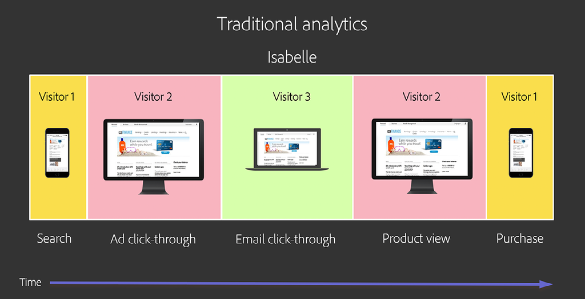
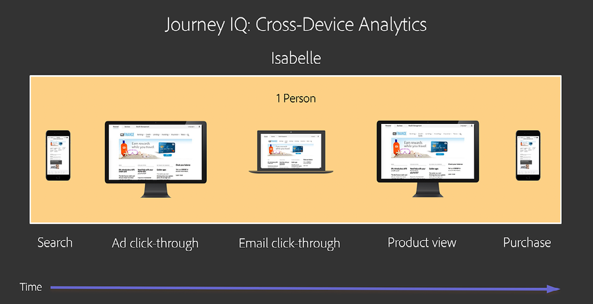
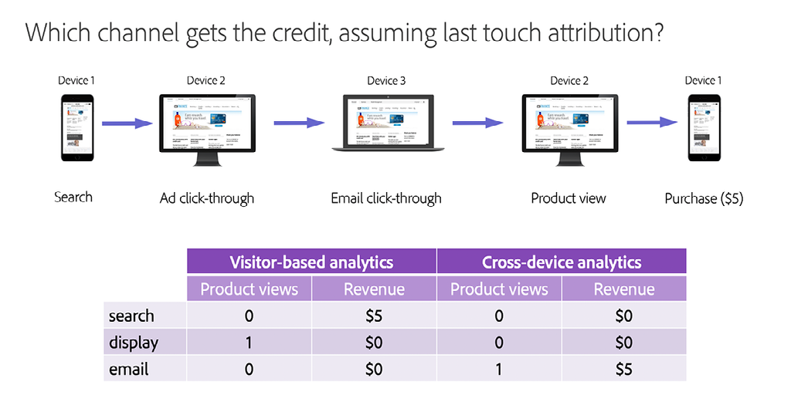
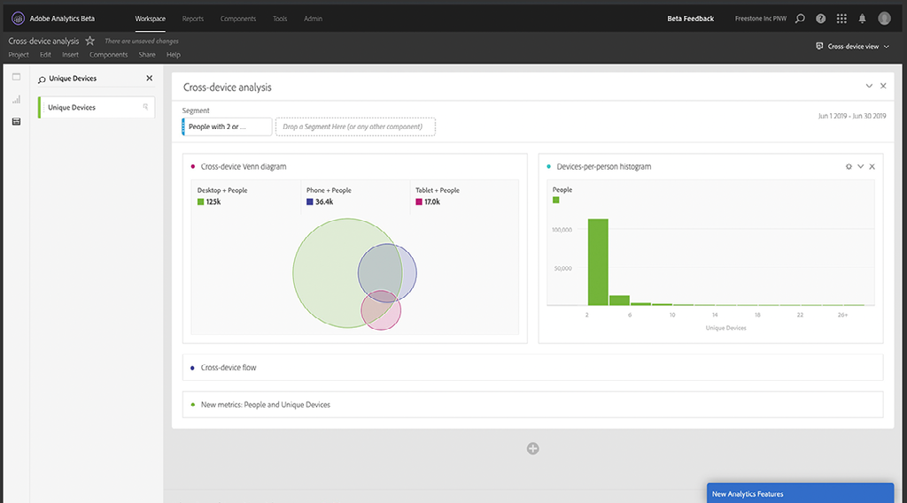

# Noções básicas e uso do [!DNL Journey IQ] - Análise entre dispositivos

Os usuários interagem com a sua marca de muitas maneiras e em vários dispositivos. A Análise entre dispositivos está integrada ao [!DNL Adobe Experience Platform Identity Service] para identificar como os dispositivos são mapeados às pessoas. Em seguida, ele usa essa inteligência para criar uma visualização entre dispositivos do comportamento do usuário. Isso resulta na capacidade de analisar pessoas, não dispositivos.

## Visão geral da Análise entre dispositivos

### Eu não sou meus dispositivos

Os usuários interagem com sua marca de muitas formas e em várias &quot;superfícies&quot; ou &quot;dispositivos&quot;. Eles podem usar um navegador da Web em um PC ou dispositivo móvel, ou podem usar um aplicativo para dispositivo móvel. Na análise digital tradicional, que se desenvolveu com a coleta de dados baseada em cookies, cada uma dessas superfícies é representada como um &quot;visitante&quot; único. Isso significa que cada um dos usuários humanos é representado como um múltiplo de visitantes únicos.

Veja um exemplo. Suponha que Isabelle interagiu com sua marca da seguinte maneira:

*Isabelle é três visitantes*

Usando a análise tradicional, a jornada de Isabelle é dividida em três partes. Ela é representada como três visitantes únicos, cada um usando um dispositivo diferente para executar tarefas isoladas. É necessário uma visão unificada, entre dispositivos, das interações de Isabelle. O [!DNL Journey IQ: Cross-Device Analytics] fornece essa visualização.

*Isabelle é uma pessoa*

### Uma visualização entre dispositivos fornece análises melhores

Ter uma visão centrada em pessoas e entre dispositivos do comportamento de Isabelle pode fazer uma diferença significativa na sua análise. Por exemplo, a abordagem tradicional baseada em visitantes não fornece a visão completa da eficácia do canal de marketing. Vamos olhar para a jornada de Isabelle mais uma vez, focando qual canal recebe crédito pela visualização do produto e pela compra. Usaremos a atribuição [!UICONTROL last-touch] para simplificar, mas o mesmo problema ocorre usando qualquer modelo de atribuição ao dividir o comportamento de Isabelle em visitantes separados. Usar a visão tradicional do mundo baseada em visitantes produz resultados muito diferentes, até mesmo enganosos:

*Análise tradicional vs. Análise entre dispositivos*

Observe que, com a visualização entre dispositivos, o canal de email recebe crédito pela exibição do produto e pela compra, o que representa com maior precisão a experiência real de Isabelle.

Continue lendo para saber mais sobre:

* Como a [!DNL Cross-Device Analytics] funciona
* Pré-requisitos para a [!DNL Cross-Device Analytics]
* Interpretação de dados entre dispositivos
* Análise de dados entre dispositivos no Analysis Workspace

## Como a [!DNL Cross-Device Analytics] funciona

A [!DNL Journey IQ: Cross-Device Analytics (CDA)] se integra ao[!DNL Adobe Experience Platform Identity Service], utilizando  o [!DNL Device Graph] para identificar como dispositivos se associam a pessoas. Em seguida, ele usa essa inteligência para criar uma visualização entre dispositivos do comportamento do usuário. A CDA inclui recursos e ferramentas imbatíveis para ajudar sua empresa a entender o uso de vários dispositivos e a experiência do cliente nesses dispositivos em suas interações com a sua marca. Ela está uma camada abaixo do Analysis Workspace para fornecer um insight profundo sobre a análise de públicos-alvo com base em pessoas e sobre a atribuição, segmentação e análise de jornada entre dispositivos usando ferramentas poderosas como o [!UICONTROL Fallout], [!DNL Flow], [!DNL Cohort], [!DNL Segment IQ] e [!DNL Attribution IQ].

### O [!DNL Cross-Device Virtual Report Suite]

A CDA é apresentada por meio de um tipo especial de [[!UICONTROL Conjunto de relatórios virtuais]](https://experienceleague.adobe.com/pt-br/docs/analytics/components/virtual-report-suites/vrs-about) entre dispositivos. Isso permite que você continue usando o conjunto original de relatórios baseado em dispositivos ao introduzir a análise entre dispositivos na sua organização. Configurar um Conjunto de relatórios virtual (VRS) de análise entre dispositivos (CDA) é fácil.

Na etapa um, do construtor de VRS, escolha o [!UICONTROL conjunto de relatórios] que foi configurado pela Adobe como habilitado para CDA:

*Escolha um conjunto de relatórios de base habilitada para CDA (fonte) *
![[!UICONTROL Conjunto de Relatórios Virtuais] Etapa Um](assets/cda-vrs-step-one.png)

Em seguida, habilite o [!UICONTROL Processamento de tempo do relatório] e habilite a [!UICONTROL compilação entre dispositivos]:

*Habilitar [!UICONTROL processamento de tempo do relatório] e [!UICONTROL compilação entre dispositivos]*
![[!UICONTROL Conjunto de Relatórios Virtuais] Etapa Dois](assets/cda-vrs-step-two.png)

Termine a configuração do VRS e salve-a. O VRS da CDA será exibido no Analysis Workspace com um ícone especial ao lado dele, conforme mostrado abaixo:

*Selecionar o VRS da CDA no Analysis Workspace*
![[!UICONTROL Conjunto de Relatórios Virtuais] Etapa Três](assets/cda-vrs-step-three.png)

>[!TIP]
>
>Você pode criar quantos [!UICONTROL conjuntos de relatórios virtuais] de CDA você desejar além do [!UICONTROL conjunto de relatórios] de base habilitada para CDA.

### Histórico de reiteração

Às vezes demora um pouco para que os usuários façam logon e para que o [!DNL Device Graph] os identifique e associe os seus dispositivos. A CDA utiliza uma janela retroativa de até 30 dias, permitindo reiterar um visitante não identificado anteriormente como uma pessoa em até 30 dias retroativos.

Como isso pode ser de ajuda? Lembre-se da jornada da usuária Isabelle da discussão acima:

![[!DNL Cross-Device Analytics] Jornada](assets/cda-isabelle-journey-cross-device-analytics.png)

É possível que a Isabelle não tenha feito logon até um pouco antes de fazer a compra e que o [!DNL Device Graph] tenha associado os dispositivos de Isabelle só algum tempo depois da compra. Mas os 30 dias retroativos da CDA permite que a CDA reitere o comportamento de Isabelle em nível de pessoa, fornecendo a visualização entre dispositivos necessária da jornada dela.

>[!NOTE]
>
>Já que o histórico pode ser reiterado, isso significa que os seus dados podem mudar com o tempo em um [!UICONTROL conjunto de relatórios virtual] habilitado para CDA. Lembre-se disso ao comunicar insights de uma análise baseada em CDA.

## Pré-requisitos para [!UICONTROL Análise entre dispositivos]

A CDA está incluída com [[!DNL Analytics Ultimate]](https://helpx.adobe.com/br/legal/product-descriptions/adobe-analytics.html). A partir de setembro de 2019, os clientes do [!DNL Analytics Ultimate] que atenderem aos pré-requisitos listados abaixo estarão qualificados para usar a CDA. Os pré-requisitos para a CDA são os seguintes:

* Sua empresa deve usar o [!DNL Adobe Experience Platform Identity Service Device Graph].
* Você deve implementar todos os requisitos do [!DNL Device Graph], inclusive a [Experience Cloud ID (ECID)](https://experienceleague.adobe.com/docs/id-service/using/home.html?lang=pt-BR) e a sincronização da ID com o gráfico.
* No momento, não é possível usar duas organizações IMS com um único [!DNL Device Graph], portanto, você deve padronizar em uma única organização IMS.
* O [!DNL Device Graph] e alguns componentes da CDA estão hospedados no [!DNL Microsoft Azure]. Isso significa que os dados do [!DNL Analytics] são copiados reciprocamente entre o centro de processamento de dados da Adobe e a presença da Adobe no [!DNL Microsoft Azure]. Alguns dados do [!DNL Analytics] serão armazenados no [!DNL Azure]. Sua empresa deve concordar com esse arranjo.
* A CDA requer um [!UICONTROL conjunto de relatórios] &quot;entre dispositivos&quot;. Ou seja, o [!UICONTROL conjunto de relatórios] que você usa para a CDA deve incluir dados de vários dispositivos diferentes ou &quot;superfícies&quot;, como Web para desktop, Web para dispositivo móvel e aplicativo para dispositivo móvel. A partir de setembro de 2019, o volume de chamadas do servidor para o [!UICONTROL conjunto de relatórios] deve ter 100MM de chamadas do servidor por dia ou menos. (Os limites do volume de chamadas do servidor aumentarão nos próximos meses.)

## Interpretação de dados entre dispositivos

### Pessoas não visitantes

No [!UICONTROL Conjunto de relatórios virtuais] da CDA, você verá algumas alterações. Por exemplo, a métrica [!UICONTROL Visitantes únicos] foi substituída por duas métricas novas: [!UICONTROL Pessoas] e [!UICONTROL Dispositivos exclusivos]. Essas novas métricas fornecem um insight muito melhor sobre o tamanho do público-alvo.

*Pessoas e Dispositivos Exclusivos*
![Métrica de [!UICONTROL Pessoas]](assets/cda-people-metric.png) do CDA

No [[!UICONTROL Construtor de segmentos]](https://experienceleague.adobe.com/docs/analytics/components/segmentation/segmentation-workflow/seg-build.html?lang=pt-BR), o contêiner do segmento [!UICONTROL Visitante] foi substituído por um contêiner do segmento [!UICONTROL Pessoa]. Usando um VRS da CDA, você pode criar segmentos entre dispositivos, como:

* Pessoas que usam mais de um dispositivo
* As pessoas que começam sua jornada em um dispositivo móvel e depois compram um computador de mesa
* Visitas em que as pessoas usam mais de um dispositivo para realizar uma tarefa

*Segmentos de nível de pessoa*
![[!DNL Segment Builder] [!UICONTROL Pessoa] Contêiner](assets/cda-segment-builder-person-container.png)

### Persistência de dimensão

Em um VRS da CDA, dimensões como [!DNL eVars] agora permanecem automaticamente em todos os dispositivos. Por exemplo, uma [!DNL eVar] que é configurada como:

* Alocação: Mais recente (último)
* Expira após: Compra

agora, permanecerá automaticamente de um dispositivo para outro até que o evento de compra seja acionado.

## Análise de dados entre dispositivos no Analysis Workspace

### Análise de público-alvo com base em pessoas

Você já se perguntou quantas pessoas estão interagindo com a sua marca? Você já quis entender quantos e quais tipos de dispositivos eles usam? Como o seu uso se sobrepõe? Usando um VRS da CDA, você pode criar [Diagramas de Venn](https://experienceleague.adobe.com/docs/analytics/analyze/analysis-workspace/visualizations/venn.html?lang=pt-BR) entre dispositivos e [histogramas](https://experienceleague.adobe.com/docs/analytics/analyze/analysis-workspace/visualizations/histogram.html?lang=pt-BR) de dispositivos por pessoa.

*Análise de público-alvo com base em pessoas*

### [!DNL Flow] entre dispositivos

Com a CDA e o Analysis Workspace, você pode visualizar como as pessoas estão mudando de um dispositivo para outro ao longo do tempo na [[!DNL Flow visualization]](https://experienceleague.adobe.com/docs/analytics/analyze/analysis-workspace/visualizations/flow/flow.html?lang=pt-BR). Você pode ver onde eles desistem em sua jornada, e onde continuam.

*[!DNL Flow]com CDA*
![[!DNL Flow Visualization]](assets/cda-flow-viz.png)

### [!DNL Fallout] entre dispositivos

Provavelmente você usa várias [[!DNL Fallout visualizations]](https://experienceleague.adobe.com/docs/analytics/analyze/analysis-workspace/visualizations/fallout/fallout-flow.html?lang=pt-BR) para analisar o desempenho dos usuários em uma determinada série de etapas antes de alcançar o sucesso. Você sabia que a sua visão dessas [!DNL Fallout visualizations] fica limitada ao usar as análises tradicionais baseadas em dispositivos? Para que uma sequência de etapas bem-sucedida, a próxima etapa deve ocorrer no mesmo navegador ou aplicativo que a anterior. Na análise baseada em dispositivos, você não consegue ver as pessoas que concluem com sucesso a próxima etapa em outro dispositivo.

Não se preocupe, a CDA tem a solução. A CDA cria a visualização entre dispositivos que torna o [!DNL Fallout visualizations] muito mais útil. Afinal, o que realmente importa é se a pessoa atingiu o objetivo no final, em algum lugar.

*[!DNL Fallout]com CDA*
![[!DNL Fallout Visualization]](assets/cda-fallout-viz.png)

### [!DNL Cross-Device Attribution IQ]

Como a CDA cria uma camada de dados entre dispositivos no Analysis Workspace, toda a análise será aprimorada com uma perspectiva entre dispositivos. Um exemplo eficaz é por meio do [[!DNL Attribution IQ]](https://experienceleague.adobe.com/docs/analytics/analyze/analysis-workspace/panels/attribution/attribution.htm?lang=pt-BR). O [!DNL Attribution IQ] no Analysis Workspace permite comparar vários modelos de atribuição lado a lado. Ao usar esse recurso com a CDA, é possível comparar como dispositivos diferentes contribuem para o sucesso.

Por exemplo, suponhamos que você queira entender com que frequência um celular é o primeiro dispositivo usado em uma interação que leva ao sucesso. Isso representa a &quot;taxa de aquisição&quot; do celular. A CDA e o [!DNL Attribution IQ] permite fazer essa análise:

*[!DNL Attribution IQ]com CDA*
![[!DNL Attribution IQ]](assets/cda-attribution-iq.png)

Para obter mais informações, consulte a [[!DNL Cross-Device Analytics] documentação de ajuda](https://experienceleague.adobe.com/docs/analytics/components/cda/overview.html?lang=pt-BR)
