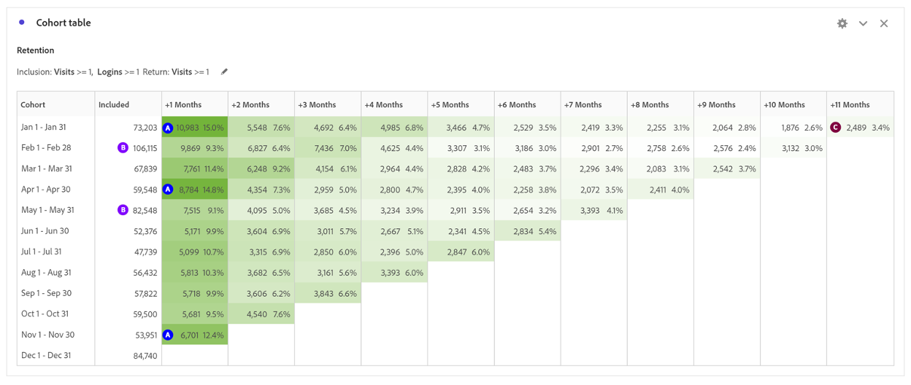

# Usar a análise de coorte para entender o comportamento do cliente

Para melhorar a experiência e a receita do cliente, as empresas devem entender o comportamento do cliente. A análise de coorte pode ajudar a compreender o engajamento e a retenção, resultando em ações como melhorar a criação de contas e criar campanhas para meses de alto volume.

A análise do desempenho digital é fundamental para entender como os clientes interagem com uma empresa e quais ações podem ser tomadas para melhorar sua experiência. Nesta publicação do blog, exploraremos como usar a análise de coorte para entender melhor o comportamento do cliente.

## Parte 1: Comparação do desempenho digital entre visitas de primeira e de retorno

### Definir o palco

Um cliente pretende entender o desempenho da Digital nos últimos 2 anos e está considerando desenvolver um programa de fidelidade para impulsionar o desempenho digital. Para começar, podemos observar a combinação de sites atual entre usuários novos e repetidos para entender como os dois grupos de visitantes se comportam hoje.

Desempenho digital atual

1. Em 2022, 62% dos pedidos eram provenientes de primeiras visitas, em comparação com 38% dos pedidos feitos por visitas de retorno (sujeitas a cookies, vários dispositivos).
1. As primeiras visitas são convertidas em uma taxa ligeiramente mais alta do que as visitas de retorno para ambos, 11,6% vs. 11,4%.
1. Em comparação com 2021, as taxas de conversão diminuíram em ambos os segmentos.

## Parte 2: Análise de coorte - produto global Visitas Compatíveis

Para entender a adesão do canal Digital e a oportunidade de impulsionar compradores repetidos, a próxima pergunta a responder é: Qual é o volume de visitantes que retornam ao site todos os meses em 2022?

### Introdução à análise de coorte

A análise de coorte é uma ferramenta útil para entender como os coortes interagem com uma marca ao longo do tempo. Para começar, determinamos quais perguntas responder:

1. Em um determinado ano, qual é o período médio de retenção mensal?
1. Que volume de visitantes do site retornam a cada mês em um determinado ano?
1. Qual é o impacto dos logons na retenção?
1. Existem produtos específicos que levaram a uma retenção mais alta?

Como configurar a Tabela de coorte

1. Definir intervalo de datas como Jan a Dez 2022
1. **Critérios de inclusão:** Visitas
1. **Critérios de retorno:** Visitas
1. **Granularidade:** Mês
1. **Configurações:** Cálculo contínuo \*\*Permite calcular a retenção com base na coluna anterior, não na coluna incluída. Portanto, isso significa que um usuário é incluído em cada um dos meses\*\*
1. **Segmentos:** você pode selecionar segmentos específicos para impulsionar essa análise ainda mais
   1. Páginas de aterrissagem específicas
   1. Tipo de dispositivo
   1. Canais de marketing
   1. Etc.

### Interpretação dos resultados

**Em 2022:**

1) Os meses com as maiores taxas de retenção +1 mês incluem janeiro, abril e novembro
1) Meses com o maior volume incluem fevereiro e maio
1) Há aproximadamente 1.000 visitantes que retornam ao site todo mês

**Em 2021:**

1) Os meses com as maiores taxas de retenção +1 mês incluem abril, janeiro e março
1) Meses com o maior volume incluem fevereiro e maio

**Itens de ação:**

Crie um segmento com base em ~1.000 Visitantes e saiba mais sobre eles:

- Onde eles estão localizados?
- Que produtos compram ao longo do ano?
- De quais lojas eles estão comprando?

Meses-chave destacam a oportunidade de conduzir retenção com base no volume:

- Há táticas específicas que possam impulsionar adesão adicional durante fevereiro e maio para aproveitar o volume?

Repetir análise para pedidos para entender compradores repetidos

- As taxas de retenção de +1 mês mais altas para os mesmos meses?
- Os meses mais altos de Visitas são os mesmos para Pedidos?

## Parte 3: Adicionar duas métricas ao critério de inclusão

### Noções básicas sobre o impacto do logon

Como esse cliente pretende entender o valor de um programa de Fidelidade, a próxima etapa da análise incluiu a adição do evento de sucesso de Logon como uma métrica de Inclusão ao Coorte.

Aviso: A análise de coorte não pode ser usada para métricas calculadas (como Taxa de conversão) ou métricas não inteiras (como Receita). Somente as métricas que podem ser usadas em segmentos podem ser usadas em Análises de coorte, e só podem ser aumentadas >1 por vez.

O site tem mais probabilidade de manter os usuários que estão fazendo logon?

Qual seria o impacto se pudéssemos fazer com que mais usuários fizessem logon? É uma experiência mais forte?

### Configuração da tabela de coorte

1. **Definir intervalo de datas:** a janeiro a dezembro de 2022
1. **Critérios de inclusão:** Visitas + Evento bem-sucedido de logon
1. **Critérios de retorno:** Visitas
1. **Granularidade:** Mês
1. **Configurações:** Cálculo contínuo \*\*Permite calcular a retenção com base na coluna anterior, não na coluna incluída. Portanto, isso significa que um usuário é incluído em cada um dos meses\*\*

### Interpretação dos resultados

**Em 2022:**

1) Os meses com as maiores taxas de retenção +1 mês incluem janeiro, abril e novembro (os mesmos meses que a primeira tabela de coorte)
1) Meses com o maior volume incluem fevereiro, maio e dezembro
1) Há ~2500 visitantes que retornam todo mês \*\*mais do que duplo\*\*

**Itens de ação:**

Investigar a experiência do usuário do site para fazer com que os usuários criem uma conta durante o Check-out

## Parte 4: Coorte de Dimension personalizado

Dimensão de coorte personalizada: crie coortes com base na dimensão selecionada, em vez de coortes com base no tempo (padrão). Muitos usuários desejam analisar suas coortes segundo critérios que não sejam o tempo, por isso o novo recurso de Coorte de dimensão personalizada permite ter flexibilidade para criar coortes com base nas dimensões desejadas. Use dimensões como canal de marketing, campanha, produto, página, região ou qualquer outra dimensão no Adobe Analytics para mostrar como a retenção é alterada com base nos diferentes valores dessas dimensões. O

A definição de segmento Dimension Coorte personalizado aplica o item de dimensão somente como parte do período de inclusão, não como parte da definição de retorno.

Depois de escolher a opção Dimensão de coorte personalizada, você pode arrastar e soltar qualquer dimensão que desejar na área designada. Isso permite comparar itens de dimensão similares entre o mesmo período de tempo. Por exemplo, você pode comparar o desempenho de cidades lado a lado

lado, produtos, campanhas etc. Ele retornará os 14 itens de dimensão principais. Entretanto, você pode usar um filtro (acesse-o passando o mouse sobre o lado direito da dimensão que foi arrastada) para exibir somente os itens de dimensão desejados. Um Coorte de dimensão personalizado não pode ser usado com o recurso de Tabela de latência.

### Quais produtos estão acionando a adesão ao site?

A tabela Dimension Coorte personalizada destaca os produtos que estão aumentando as taxas de retenção em relação à média.  Essa tabela ajuda a identificar seus principais produtos para impulsionar campanhas de marketing internas e externas com produtos de maior atenção.

**Em Fev:** 3 produtos sobressalentes com taxas de retenção mais altas

1) Product1
1) Product 2
1) Product 3

**Em Mar:**

1) Product1
1) Product 2
1) Product 3 — supera frequentemente o desempenho com uma taxa de retenção mais alta em comparação à retenção média.

## Conclusão

A análise de coorte e o Custom Dimension Coort são ferramentas poderosas para entender o comportamento de clientes e melhorar o desempenho digital. Analisando as taxas de retenção, as taxas de login e o impacto de produtos específicos, as empresas podem tomar decisões orientadas por dados para melhorar a experiência do cliente e impulsionar o crescimento.

## Autora

Este documento foi escrito por:

**Jennifer Yacenda**, Director sênior na Marriott

Especialista em Adobe Analytics