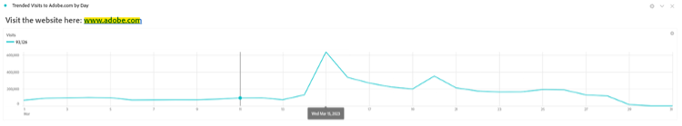

# Mais do que palavras - Uso de visualizações e descrições de texto no Analysis Workspace

Como usuário do Adobe Analytics Analysis Workspace, é natural que seu foco seja direcionado frequentemente para suas visualizações de dados e dados - qualquer pessoa pode digitar um resumo, certo? No entanto, ignorar recursos no Analysis Workspace como a visualização de Texto ou as descrições de visualização pode significar a falta de uma oportunidade valiosa para combinar seus insights com texto, imagens, gifs e links valiosos. Ao fornecer referências e mais contexto para informar seus usuários sobre o que seus dados significam, isso pode torná-lo mais eficaz e impactante.

Primeiro, certifique-se de saber onde encontrar esses recursos:

- Para adicionar ou modificar a Descrição de uma visualização, basta clicar com o botão direito do mouse na área superior do elemento e selecionar o link &quot;Editar descrição&quot;:

   

- Para adicionar um painel Texto separado, clique no menu Visualizações da barra de navegação esquerda:

   

Embora este guia mostre um exemplo usando um desses dois métodos, você pode fazer adições semelhantes em descrições e visualizações de texto. Você também pode ajustar o tamanho da fonte, o alinhamento, a cor e criar listas com marcadores ou numeradas:

Vamos começar. Um contexto muito útil para adicionar a qualquer projeto do Analysis Workspace é um hiperlink. Isso pode incluir a vinculação ao URL da página detalhada no relatório, links para outros projetos do Analysis Workspace, páginas de contexto de relatório externo ou qualquer outra coisa que possa ser útil ao visualizar o relatório. Esse recurso é acessível selecionando qualquer parte do texto e selecionando o ícone &quot;link&quot;:

O resultado é que qualquer pessoa que visualize o projeto do Analysis Workspace pode acessar qualquer página acessível online ou na intranet de sua organização com um único clique:

Agora, se preferir trazer o conteúdo diretamente para o seu relatório, você pode usar um link de Imagem para colocar o conteúdo ao lado dos dados:

Você pode adicionar uma imagem acessível em qualquer URL público ao seu relatório, desde que o URL esteja em *https* e é formatado como um .png, .jpeg, .jpg ou .gif - embora isso possa soar restritivo, quaisquer ferramentas online usadas para compartilhar imagens ou GIF como imgur ou GIPHY podem fornecer um método rápido para carregar arquivos acessíveis no Workspace usando um Link de compartilhamento.

O resultado? Você pode mostrar a página da Web que seus dados estão referenciando diretamente no seu projeto:

Você também pode usar GIF em seus projetos para incluir imagens em movimento como uma apresentação do site, um caminho ideal através do seu site ou uma tarefa no seu aplicativo, ou simplesmente mostrar à sua equipe como ***impressionante*** seus relatórios agora se tornaram:

## Autora

Este documento foi escrito por:

**Dan Cummings**, Gerente sênior de análise de engenharia de produto na McDonald&#39;s Corporation

Especialista em Adobe Analytics

