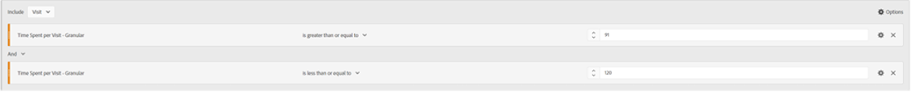

# Agora aguarde um segmento... usando segmentos para descobrir novos insights no Analysis Workspace

Quer você seja um novo usuário do Adobe Analytics ou um profissional experiente, você aproveitará os segmentos um pouco em seus projetos do Analysis Workspace. As [Adobe Experience League](https://experienceleague.adobe.com/docs/analytics/components/segmentation/seg-overview.html?lang=pt-BR) descreve, &quot;os segmentos permitem identificar subconjuntos de visitantes com base em características ou interações de site&quot;. Embora o resultado básico desse recurso signifique isolar grupos de usuários, visitas ou ocorrências do site, um analista atento, como você, pode se tornar criativo com essa ferramenta e encontrar novas maneiras de obter insights sobre a atividade do site. A lista de opções possíveis é vasta, portanto, não hesite em tentar criar a sua e compartilhá-la com outras pessoas em sua organização ou on-line em comunidades como a [Comunidade Adobe Analytics](https://experienceleaguecommunities.adobe.com/t5/adobe-analytics/ct-p/adobe-analytics-community?profile.language=pt) no Experience League ou na [#Measure Slack](https://www.measure.chat/) comunidade.

Se você precisar de um atualizado rápido sobre como criar um segmento, consulte a documentação do Experience League sobre como usar o [Construtor de segmentos](https://experienceleague.adobe.com/docs/analytics/components/segmentation/segmentation-workflow/seg-build.html?lang=en) no Analysis Workspace.

## Comparação e contraste de segmentos

No Analysis Workspace, você pode comparar dois segmentos usando &quot;[Comparação de segmentos](https://experienceleague.adobe.com/docs/analytics/analyze/analysis-workspace/panels/segment-comparison/segment-comparison.html?lang=pt-BR)&quot;. A comparação de segmentos pode ser encontrada na seção Painéis da barra de navegação esquerda:

No entanto, às vezes, você não precisa de um painel de comparação completo para direcionar os principais insights dos usuários finais. Felizmente, alguns recursos também podem ser comparados em um painel padrão.

O [Visualização do diagrama Venn](https://experienceleague.adobe.com/docs/analytics/analyze/analysis-workspace/visualizations/venn.html?lang=pt-BR) O pode ajudar a criar uma comparação rápida, permitindo que você passe o mouse e veja as sessões, pedidos, usuários sobrepostos, etc. entre 2 e 3 segmentos personalizados. Você também pode criar segmentos rapidamente clicando com o botão direito do mouse em qualquer uma das seções sobrepostas:

Às vezes, as informações importantes não estão nos dados sobrepostos, mas os dados que não se sobrepõem. Uma maneira rápida de visualizar isso é criar uma cópia de um segmento e torná-lo um segmento &quot;Excluir&quot;:

Empilhando seu segmento &quot;excluir&quot; com o outro segmento na comparação, você pode calcular rapidamente quantas visitas acessaram a página do menu sem visualizar também a página inicial na mesma sessão:

## Empilhar Ataque

Da mesma forma, é possível criar os dados de interseção de um diagrama Venn simplesmente empilhando todos os segmentos. Não há limite para quantos segmentos ou dimensões individuais você empilha. Por exemplo, se eu quisesse descobrir rapidamente quais Dias da Semana no mês passado meu site tinha uma visita a um Telefone Celular, especificamente um Samsung Galaxy A52s, que viu meu menu e páginas de nutrição, mas NÃO viu minha página inicial, eu posso construí-lo rapidamente assim:

Mas melhor ainda, assim que encontrar o subconjunto perfeito do meu usuário ou da minha base de visitas, posso selecionar todos esses valores, clicar com o botão direito do mouse e criar um segmento instantaneamente:

Isso é muito poder em um segmento.

## Um segmento de números para um número de segmentos

Muitas vezes, muitos usuários observam valores nominais, ordinais ou de intervalo ao criar segmentos, como uma página visitada, um intervalo de idades de usuários ou o número de visitas que um usuário fez no passado. No entanto, também é possível usar dados de proporção ao criar um segmento definindo esses valores como dimensões padrão, métricas padrão ou variáveis e métricas personalizadas para sua organização.

Por exemplo, Tempo gasto na página ou Tempo gasto por visita tem compartimentos pré-construídos disponíveis:

No entanto, elas podem não estar sempre de acordo com as necessidades da sua organização - talvez a maioria das visitas ao site sejam executadas em menos de 10 minutos. Você pode usar a medição granular para criar compartimentos de tamanho diferente. Aqui está um criado para observar visitas que duram entre 1 minuto, 1 segundo e 1 minuto, 30 segundos:

Depois de criado, agora posso começar a ver minhas visitas, pedidos e outros eventos pelos diferentes grupos de tempo segmentados que personalizei:

Você pode até começar a examinar como os Indicadores-chave de desempenho (KPIs) são alterados como um fator de tempo gasto por um usuário, quantas páginas ele acessou em uma visita, quantas vezes ele visitou no passado ou qualquer outro valor numérico, permitindo basicamente observar uma métrica como um fator de outra métrica:

As possibilidades de usar segmentos para encontrar novos insights são infinitas! Trata-se simplesmente de um ponto de partida. Experimente sozinho e informe a comunidade sobre o que você descobre: [Comunidade Adobe Analytics](https://experienceleaguecommunities.adobe.com/t5/adobe-analytics/ct-p/adobe-analytics-community?profile.language=pt) no Experience League ou na [#Measure Slack](https://www.measure.chat/) comunidade.

Feliz segmentação!

## Autora

Este documento foi escrito por:

**Dan Cummings**, Gerente sênior de análise de engenharia de produto na McDonald&#39;s Corporation

Especialista em Adobe Analytics

