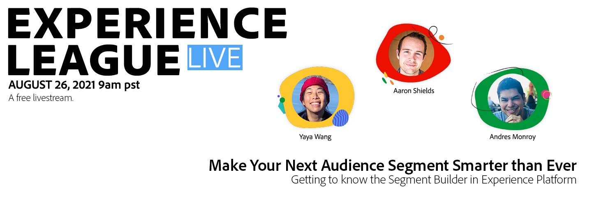

# Experience League LIVE

## Junte-se a nós para o próximo episódio.

Experience League LIVE é um programa de streaming ao vivo produzido pela equipe da Experience League.  É uma chance de se conectar com especialistas em produtos da Adobe e aprender dicas, truques e estratégias úteis que podem ser usados com os aplicativos da Adobe Experience Cloud.

## Próximos eventos do Experience League LIVE.

<table>
<tr>
  <td>
      
     

          <strong>Jornadas do cliente</strong>
     

     

          <em>Setembro de 2021</em>
     

    

    <em>Aprenda com especialistas em produtos como criar experiências que se adaptam aos clientes em tempo real</em>
    

  </td>
  <td>
      
     

          <strong>Conteúdo e Comércio</strong>
     

          <em>Outubro de 2021</em>
     

     

    

    <em>Saiba como criar e gerenciar conteúdo em escala e criar experiências de comércio personalizadas</em>
    

  </td>
  <td>
      
     

          <strong>Experience Platform</strong>
     

     

          <em>Dezembro de 2021</em>
     
    
    

    <em>Aprenda com especialistas em produtos a criar experiências que se adaptam aos clientes em tempo real</em>
    

  </td>
</tr>
</table>

## Episódios anteriores

Você perdeu um episódio do Experience League LIVE? Perdoamos você. Veja qualquer um dos nossos episódios anteriores.

<table>
<tr>

<td>
    
     

          <strong>Convidados</strong>: <i>Eric Matisoff e Dasha Fitzpatrick</i>
     

     

          <em>29 de julho de 2021</em>
     
    
    

    <em></em>
    

  </td>
</tr>
</table>

>[!TIP]
>
>Para obter métodos adicionais de aprendizado, consulte nossos [cursos](https://experienceleague.adobe.com/?lang=pt-BR#dashboard/learning) gratuitos, bem como [tutoriais](https://experienceleague.adobe.com/docs/home-tutorials.html?lang=pt-BR) individuais.
