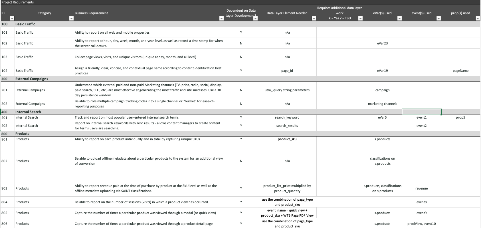

# O que é análise? {#what-is-analytics}

Antes de mergulhar no conteúdo e aprender sobre o Adobe Analytics, é importante poder responder a essa pergunta fundamental: “O que é análise?” Análise é um termo amplo que engloba várias disciplinas para impulsionar o desenvolvimento e a transformação de negócios, ou seja, a análise de dados e negócios. Há uma distinção entre os dois. Vamos dar uma olhada mais de perto.

## A função da análise de negócios

Nos últimos anos, o uso da Internet para fins comerciais evoluiu rapidamente desde a sua criação, assim como a quantidade de dados acumulados pelas organizações sobre a maneira como os consumidores interagem e se envolvem com sua marca. Se você já ouviu o termo Big Data antes, ele se enquadra no domínio de análise de negócios.

A análise de negócios é um componente da inteligência de negócios e se concentra em riscos e oportunidades estratégicas de grande porte. É um recurso necessário que as empresas devem ter para se manterem competitivas em seus setores.

Há quatro tipos de análises de negócios:

* **Descritiva**: envolve a utilização de dados históricos para identificar tendências nos negócios de uma organização. Por exemplo, um varejista precisa prever a demanda do produto antes dos períodos de pico ou épocas festivas e necessita de um inventário ideal para atingir suas metas comerciais.
* **Diagnóstica**: quais são as razões por trás de um resultado inesperado? Por que houve uma alta demanda por um produto ou serviço durante a baixa temporada? A análise diagnóstica é um tipo de análise descritiva mais profunda que visa determinar correlações a partir dos dados.
* **Preditiva**: usa dados históricos para determinar resultados ou eventos prováveis. O aprendizado de máquina (ML) e a inteligência artificial (IA) são normalmente usados para fazer previsões mais precisas. O cancelamento do cliente é um exemplo de aplicação real da análise preditiva. Essa análise encontra correlações para identificar os atributos dos clientes que provavelmente farão o cancelamento, de modo que você possa fazer algo para evitar isso.
* **Prescritiva**: é uma forma avançada de análise preditiva que visa descobrir o melhor caminho possível para um resultado desejado. Esse tipo de análise utiliza também as tecnologias de ML e IA. Os varejistas utilizam análises prescritivas para melhorar as margens, fazendo alterações em suas operações.

## A função da análise de dados

A análise de dados usa muitas das mesmas tecnologias usadas na análise de negócios, mas tem um escopo mais amplo e uma natureza mais técnica. A análise de big data, por exemplo, depende da qualidade e da organização dos dados. Qual é a eficiência da classificação, do armazenamento e da limpeza de dados? Os cientistas de dados trabalham no domínio da análise de dados. Eles transformam grandes conjuntos de dados que os analistas de negócios usam para transmitir informações à organização para otimizar processos e métricas. Os cientistas de dados aprofundam a análise dos dados, determinando tendências e conexões.

## Onde o Adobe Analytics se encaixa?

O Adobe Analytics é uma plataforma de análise de dados robusta que coleta dados de experiências digitais em vários canais que oferecem suporte à jornada do cliente e fornece ferramentas para analisar os dados. É uma plataforma usada com frequência por profissionais de marketing e analistas comerciais para fins de análise de negócios.

Os requisitos de negócios, o design de dados e a coleção de dados são fatores fundamentais para uma prática de análise eficiente. Inicialmente, os clientes começam com a coleta de dados sobre as principais jornadas do cliente e os resultados desejados dos negócios para as experiências digitais tradicionais, como Web e de dispositivos móveis. Os dados devem responder a perguntas como:

* “Quais conteúdos e tipos de conteúdo são populares entre os visitantes?”
* “Quais caminhos resultam em conversões de alto valor, como receita, reservas, leads ou assinaturas?”
* “Quais produtos, serviços ou conteúdo devo mostrar para visitantes conhecidos e desconhecidos?”
* “Como os canais de marketing digital estão se saindo?”

Depois que a base de dados é coletada no Adobe Analytics, os profissionais de marketing e analistas comerciais usam diversos relatórios e ferramentas de visualização de dados disponíveis no produto para realizar análises e contar histórias significativas sobre os dados. Além disso, o Adobe Analytics fornece várias formas de resultados. Pode ser um segmento ou público enviado para uma ferramenta de otimização, como o Adobe Target, para executar testes A/B. Pode ser uma pontuação preditiva para indicar a probabilidade de uma ação por uma pessoa que é usada como modelo por outro sistema.

Com o tempo, os clientes enriquecem dados tradicionais da Web e móveis por meio de outras fontes de canal, incluindo o CRM, a central de atendimento, negócios tradicionais, assistentes de voz e muito mais. O Adobe Analytics oferece várias maneiras de capturar dados de praticamente qualquer origem de canal para criar uma base de dados de análise robusta.

A coleta de conjuntos de dados adicionais abre as portas para a realização de tipos mais avançados de análise prescritiva de dados que usam aprendizado de máquina ou modelos de dados avançados, como a atribuição de marketing e detecção de anomalias.

Recomendamos que você utilize os tutoriais da Experience League para aprender sobre os principais benefícios e recursos do Adobe Analytics.
