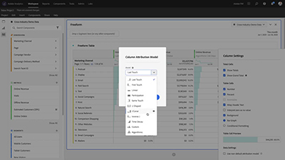

# Tutoriais do Analytics

Aproveite ao máximo o [!DNL Adobe Analytics]. Use esses tutoriais para dominar os recursos do Analytics e aproveitar os benefícios na sua empresa. Esse conteúdo é adequado para administradores, analistas de dados, profissionais de marketing, desenvolvedores e arquitetos.

Para começar,

* Consulte a seção **“Novidades”** abaixo para obter as atualizações e os recursos mais recentes.
* **As escolhas da equipe** destacam alguns de nossos conteúdos favoritos
* Explore o conteúdo por tópico e subtópico na **navegação à esquerda**
* Use o campo de **pesquisa** na parte superior da página se você souber o que deseja aprender

Experiências de aprendizagem com curadoria por função e nível de habilidade também são oferecidas na seção de cursos. Basta fazer logon com sua Adobe ID e navegar até **Aprendizagem > Cursos recomendados** na navegação superior.

## Escolhas da equipe

<table>
<tr>
  <td>
    
    

      <a href="analysis-workspace/attribution-iq/algorithmic-model-in-attribution-iq.md">
    <strong>Modelo algorítmico no Attribution IQ</strong>
    </a>
    

    

    <em>O modelo Atribuição algorítmica no Analysis Workspace usa técnicas estatísticas para determinar dinamicamente a alocação ideal de crédito para a métrica selecionada.</em>
    

  </td>
   <td>
    
    

      <a href="analysis-workspace/navigating-workspace-projects/training-tutorial-template-in-analysis-workspace.md">
    <strong>Modelo do tutorial de treinamento no Analysis Workspace</strong>
    </a>
    

    

    <em>O Tutorial de treinamento do Analysis Workspace orienta os usuários sobre a terminologia e as etapas comuns para a construção de sua primeira análise no Workspace.</em>
    

  </td>
  <td>
    
    

      <a href="analysis-workspace/analysis-workspace-basics/analysis-workspace-overview.md">
    <strong>Visão geral do Analysis Workspace</strong>
    </a>
    

    

    <em>Visão geral de alto nível do Analysis Workspace.</em>
    

  </td>
</tr>
</table>

## Recursos adicionais

[Documentação do Adobe Analytics](https://experienceleague.adobe.com/docs/analytics.html?lang=pt-BR)
