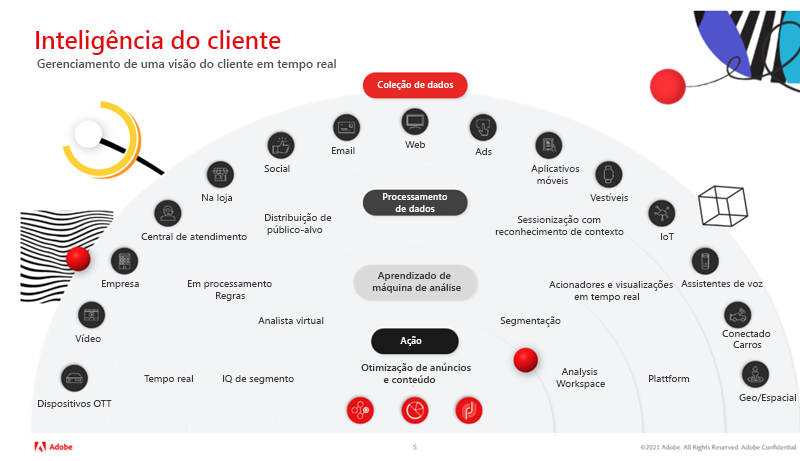

# Dominar a inteligência de clientes com o Virtual Analyst e o Segment IQ no Adobe Analytics

Neste artigo, você aprenderá a importância de usar inteligência artificial e aprendizado de máquina (IA/ML). Em seguida, analise os benefícios e veja histórias de sucesso reais de clientes globais que usam o Virtual Analyst e o Segment IQ para detectar anomalias, evitar outliers e maximizar o ROI.

## O valor da inteligência artificial

Talvez você se lembre da época em que Garry Kasparov, campeão de xadrez, foi derrotado pelo [!DNL Deep Blue] da IBM®. Os especialistas estavam convencidos de que uma máquina não conseguiria vencer a tomada de decisões e o julgamento humanos em um jogo tão complexo como o xadrez. No entanto, isso aconteceu e foi a chave para uma mudança fundamental na estratégia empresarial e na inovação tecnológica à medida que o poder da inteligência artificial era descoberto.

O Adobe Analytics é o sistema central de inteligência para empresas baseadas em experiências, e ele permite que qualquer pessoa na empresa entenda e otimize as interações do cliente com sua marca em todos os pontos de contato, em tempo real e em grande escala.

As ferramentas de IA da Adobe não estão aqui para substituir você, mas para permitir que você obtenha o máximo de ROI pelos seus esforços.

## Transformar sua análise

Para desenvolver sua análise, devemos nos concentrar em três considerações principais:

1. Organização: como criar uma visão integral dos clientes, priorizar decisões orientadas por insights e democratizar dados.

1. Tecnologia: como garantir que os dados e a tecnologia ofereçam personalização em escala.

1. Cliente: como criar confiança e adaptar-se à mudança.

O Analytics é desafiador e demanda tempo. No entanto, há uma necessidade constante de acelerar o tempo de insight. Os principais problemas que as organizações enfrentam incluem:

* Recursos organizacionais limitados: diversas metas comerciais podem limitar a disponibilidade de recursos
* Conhecimento técnico limitado: é possível compartilhar conhecimento e democratizar dados?
* Expectativas do cliente: sua equipe pode reagir dinamicamente às mudanças de comportamento do cliente?

## Domine a inteligência de clientes com o Virtual Assistant, disponibilizado pelo Adobe Sensei

### 3 níveis de inteligência de clientes

Quando se trata de uma estratégia de inteligência de clientes bem-sucedida, precisamos percorrer três níveis (veja a Figura 1 acima): (a) coleta de dados, (b) processamento de dados e (c) análise e aprendizado de máquina, antes que possamos finalmente tomar medidas e otimizar nosso conteúdo e anúncios.

1. A coleta de dados depende de sua organização e pode incluir vários canais e meios. Estes incluem: dispositivos OTT, vídeos, corporações, call centers, lojas, emails sociais, web, anúncios, aplicativos móveis, dispositivos utilizáveis, IoT, assistentes de voz, cartões conectados e informações geográficas/espaciais.

1. O processamento de dados inclui a coleta de dados em tempo real, regras de processamento, a sindicalização de público-alvo, sessões de consciência de contexto, acionadores e visualizações em tempo real e a plataforma.

1. O Analytics e o aprendizado de máquina incluem o Segment IQ, o Virtual Analyst, a Segmentação e o Analysis Workspace

### Aproveitar o Virtual Analyst

Pense no [Virtual Analyst](https://experienceleague.adobe.com/docs/analytics/analyze/analysis-workspace/virtual-analyst/overview.html?lang=pt-BR) como um especialista em análise que:

* Nunca sai do escritório e nem precisa fazer isso
* Informa o “quem”, o “que”, o “quando”, o “onde” e o “por que” do seu negócio
* Lida instantaneamente com alertas inteligentes a partir do monitoramento de anomalias em todos os dados, 24 horas por dia e 7 dias por semana
* É capaz de remasterizar componentes para o [!UICONTROL Analysis Workspace]

### Descobre oportunidades ocultas

* Obtém visibilidade de cada minuto dos status dos KPIs de marketing
* Realiza bons investimentos de marketing de maneira confiável e previsível
* Continua a atender e superar as expectativas dos clientes

### Sucesso real

O Virtual Analyst revelou os seguintes cenários para clientes reais da Adobe:

* Encerramento da campanha: aumento diário de US$ 1,7 milhão em receita, impulsionado principalmente por uma campanha que tinha sido encerrada prematuramente.
* Bug do fornecedor: aumento de 73% nas remoções do carrinho devido a um bug do gerenciador de tags que removia automaticamente determinados produtos do carrinho.
* Problema do navegador: 8% de aumento no abandono de carrinhos associado aos navegadores Chrome. Essa correção resultou em um aumento incremental diário de US$ 1,2 milhão na receita.
* Fraude de cupom: identificou um pico de 81% em pedidos causado pelo tráfego referido por dois importantes sites diários de ofertas/cupons que promoviam cupons de produtos de higiene pessoal fraudulentos. Esses pedidos puderam ser cancelados.
* Espionagem corporativa: aumento de 200% nas visitas causadas pelo bot/crawler criado pelo principal concorrente para extrair o conteúdo do site para reutilização. Esses IPs puderam ser bloqueados.

## Recursos do Adobe Analytics

[Detecção de anomalias](https://experienceleague.adobe.com/docs/analytics/analyze/analysis-workspace/virtual-analyst/anomaly-detection/anomaly-detection.html?lang=pt-BR):

* Use algoritmos preditivos integrados para ajudar a identificar picos e declínios em seus dados que você não sabia que existiam.
* Use 28 algoritmos exclusivos usados para identificar anomalias, incluindo sazonalidade, crescimento e modelos cíclicos, bem como alinhamento de feriados.
* Reduza a dependência em cientistas de dados e desbloqueie os recursos dos cientistas de dados cidadãos.

[Análise de contribuição](https://experienceleague.adobe.com/docs/analytics/analyze/analysis-workspace/virtual-analyst/contribution-analysis/ca-tokens.html?lang=pt-BR):

* Identifique rapidamente os fatores que contribuíram com mudanças significativas em seus dados.
* Economize inúmeras horas de procura por explicações para alterações nas métricas.
* Aproveite o poder do aprendizado de máquina projetado para transformar o analista e o profissional de marketing em um cientista de dados.

[Alertas inteligentes](https://experienceleague.adobe.com/docs/analytics/analyze/analysis-workspace/virtual-analyst/intelligent-alerts/intellligent-alerts.html?lang=pt-BR):

Mantenha-se informado sobre anomalias em seus dados o tempo todo — esteja você no escritório ou em trânsito

* Criar alertas diretamente do Analysis Workspace
* Regras básicas sobre anomalias (90%, 95%, 99%), % de alteração e acima/abaixo
* Use a [!UICONTROL Visualização de alertas] para ver a frequência de disparo de um alerta
* Aproveite a compatibilidade com SMS e email com links para projetos do [Analysis Workspace](https://experienceleague.adobe.com/docs/analytics/analyze/analysis-workspace/home.html?lang=pt-BR) gerados automaticamente

[Segment IQ](https://experienceleague.adobe.com/docs/analytics/analyze/analysis-workspace/segment-iq.html?lang=pt-BR):

* Descubra as diferenças e sobreposições entre os segmentos para informar sua estratégia de segmentação
* Descubra as principais características dos segmentos de público-alvo que estão liderando seus KPIs
* Obtenha relatórios e visualizações em segundos a minutos, que exibem semelhanças entre dimensões, métricas e outros segmentos
* Melhore o engajamento com clientes de alto valor

## Sucesso real com o Segment IQ

**Dispositivo móvel vs desktop:** “Comparamos as ocorrências de um de nossos sites a outro site e rapidamente encontramos um monte de inconsistências de marcação.” → Evite problemas de dados antes da liberação do produto

**Uso de recurso:** “Clientes que utilizavam nosso recurso de comparação de produto eram 10% mais passíveis de conversão. Movê-lo para o início da página aumentou o número de pedidos.” → Aumento de 4% na conversão

**Engajamento de conteúdo:** “Descobrimos que a probabilidade dos visitantes em nossa seção de notícias assistir a comerciais de vídeo era duas vezes maior, então adicionamos mais opções de vídeo àquela seção.” → Aumento de 7% nos anúncios de vídeo visualizados

**Pesquisa paga:** “Os visitantes provenientes de mecanismos de busca tinham três vezes mais chances de fazer venda adicional. Como resultado, aumentamos nosso investimento em palavras-chave específicas.” → Aumento de 56% em vendas adicionais

**Produtos sem estoque:** “As pessoas comprando Fitbits tinham 6 vezes mais chances de receber uma mensagem &#39;em falta&#39; do que os outros, então rapidamente pedimos mais Fitbits.” → Prevenção de falta de estoque e mais pedidos de período de festas concluídos

Para obter mais informações, assista ao nosso [webinário](https://adobecustomersuccess.adobeconnect.com/pmetho6ivh68/).

Saiba mais sobre estratégia e liderança de pensamento na central de [Sucesso do cliente](https://experienceleague.adobe.com/docs/customer-success/customer-success/overview.html?lang=pt-BR).